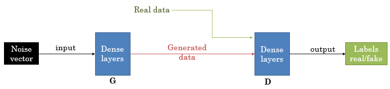

# AnimGAN
Human gesture generation using generative adversarial network

## Presentation:

The aim is to develop a program able to generate realistic animations for human-like virtual characters.
In our specific case, we want to generate body animations similar to the gestures people are doing in a conversation.
The program should use a Generative Adversarial Network (GAN) architeture.
Also, the training animations and the generated ones should use the BioVision Hierarchy (BVH) file format.

More inforamtions:
+ [GANs presentation](https://skymind.ai/wiki/generative-adversarial-network-gan)
+ [BVH format presentation](http://www.dcs.shef.ac.uk/intranet/research/public/resmes/CS0111.pdf)

## The Dataset:

The dataset is composed of BVH files from the animation database [Emotional Body Motion Database](http://ebmdb.tuebingen.mpg.de/index.php).
All the animations in this dataset were obtain with motion capture devices. They represent a person making gestures while speaking.
The character is sitting while maling the gestures.
All the file are from 2 to 12 seconds long and run at 120 frames per second (fps).

Real animations:

The code include a part of pre-processing where the animations are shortened to 3 second long and set at 12 fps.
After the pre-processing, animation are just containing 36 frames, which is quicker to process in the neural network.

Low resolution animations:

## Neural network architecture:

The neural network is a GAN that uses both Fully Connected (Dense) and Long Short Term Memory (LSTM) layers.

Scheme of the network:

## Latest results:

When can see that the lower body looks ok but the upper part is too "shaky".
Overall, it look like the network can learn but its results aren't realistic yet.

## Current issues:

GANs are known to be difficult to train. Depending on some parameters, the training is sometime giving totaly random results.
With the current architecture, the results still need to be improve.
This may come from a too small dataset, a bad neural net architecture or maybe just a parameter issues.

## Things to try:

+ Different architecture : One of the main issues with animation generation is to integrate the notion of time series.
To make the neural network able to find the coherence between each frames, we used LSTM layer, but other 'time sensitive' layer may be tried

+ Different parameters : GANs are difficult to train as they can easily give non-convergent learning curves.
Chaninging the number of layers, nodes or other parameters like the learning rates can completely change the training process, resulting in a convergent or divergent behaviour.

## Running requierements:
+ Python 3.6.5
+ Pytorch 
+ Tensorflow
+ Keras
+ Numpy

## Files:
+ AnimGAN: latest version of the programm.
+ motionData_bvhFormat: dataset of BVH files [Emotional Body Motion Database](http://ebmdb.tuebingen.mpg.de/index.php)
+ classes BVH, Animations and Quaternions: classes used in the programm to handle .bvh files.
These classes came from the work of HOLDEN Daniel, KOMURA Taku and SAITO jun in their program : [Phase-Functioned Neural Networks for Character Control](http://theorangeduck.com/page/phase-functioned-neural-networks-character-control).

## Other files:

+ Posture GAN:
Using the same dataset as the AnimGAN, this programm can generate realictic postures. These postures are just individual frames.
An animation is a serie of posture (or keyframes). Even with a simple an architure of just a few fully connected layers, this GAN can give good loooking results.
The program stack in a same BVH file samples of the generated postures during the training.
Once the network is trained, the generated frames are also concatenated in the same BVH file.
This programm was made during the developpment process of AnimGAN, as an intermediate step.

- PostureGAN architecture:

- generated posture:

